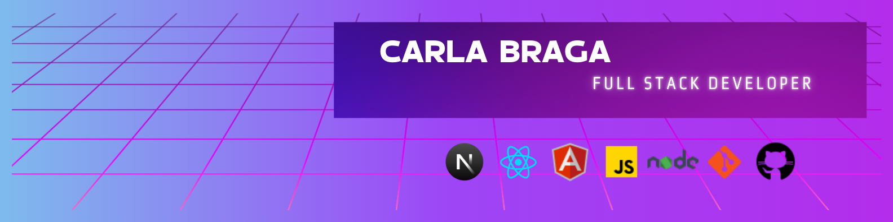

<h1 align="left">👋 Hey, What's up?</h1>

###

My name is Carla Braga A.K.A TekhneDev. I'm a Software Engineer from Brazil, currently living in Brasília! I'm working mostly with TypeScript, Next.js, Node.js, and... Well, basically anything techy you put in front of me! 

I truly love programming, especially Open-Source. I'm a developer since 2022, when I was in college. Now I have degrees in computer science and systems analysis and development, and I am currently pursuing a degree in mechatronics engineering.

<h2 align="left">About me</h2>

###

 Hi again! Nice to meet you, you can call me Carla. 
 
 My current goal is to become a Software Architect. 
 My main stack is NodeJs with React and Spring with Angular.
 
 I always try to be a polite and respectful person, and I love interacting with new people and sharing my story.
 
 Besides studying and working, I try to publish some articles on sites like Medium and DEV Community.

###

## &nbsp;My Stack

###

###

## Fun facts

- I love photography, you can check my non-profit hobbyst work on [Vsco](https://vsco.co/carlammariana/gallery).
- I am gearhead, lol, and I **love** riding motorcycles!
- I **absolutely** love all sorts of animals, I have one amazing cat, his name is Jorge, had dogs, fish, birds, and other stuff as well!
- I'm an adult with a late-diagnose of ADHD and CAPD and which makes my life not very easy, especially for creating things.

###

  

